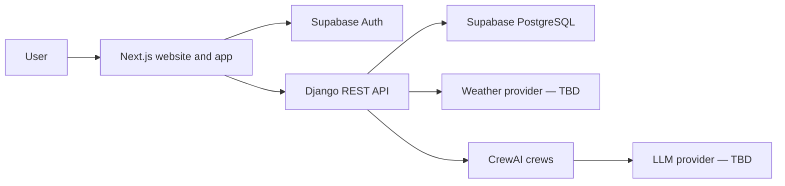

````
# TerraCast Architecture

**Company:** Meteon Labs  
**Product:** TerraCast  
**Document status:** v1 implementation baseline  
**Last updated:** 20 July 2026

## 1. Product Overview

TerraCast is a hyperlocal, AI-assisted weather intelligence platform for India. It converts live weather data into clear, localized and action-oriented guidance for farmers, outdoor workers, elderly users and general users.

The v1 product has two connected surfaces:

1. A polished public website that explains the product and guides users into authentication.
2. An authenticated weather application that provides a personalized weather brief, forecast, alerts and user preferences.

The interface should feel like a modern SaaS product while remaining usable on mid-range mobile devices, in bright outdoor conditions and by users who may not rely on text.

### v1 goals

- Deliver trustworthy live weather information for a user's selected location.
- Turn raw weather values into short, practical briefs.
- Support regional-language UI and natural localized briefs.
- Adapt presentation for farmer, outdoor worker, elderly and general modes.
- Communicate important conditions through icons and lightweight motion as well as text.
- Provide a clean public product website and a professional authenticated app shell.

### Explicitly out of scope

- Meteon Reports
- TerraCast Pro or billing
- Public developer APIs
- MCP integrations
- Research workspaces
- Redis
- Docker
- Native mobile applications

These are v2 or v3 concerns. v1 should expose clean domain boundaries, not half-build future products.

## 2. Architecture Principles

1. **One owner per concern.** Next.js owns presentation, Django owns business logic, Supabase owns authentication and PostgreSQL, and CrewAI owns agent orchestration.
2. **The backend is the trust boundary.** The browser never calls weather or LLM providers directly.
3. **Structured data before generated language.** Raw weather data is normalized and validated before any agent sees it.
4. **AI explains; verified data decides.** Official provider alerts and deterministic backend rules determine alert state and severity. AI may simplify or localize the explanation, but may not invent, suppress or independently escalate a safety alert.
5. **Progressive enhancement.** Core weather values and provider alerts remain available if AI generation fails.
6. **Localization from the first component.** All strings use `next-intl` from Phase 1, even though full regional translations arrive later.
7. **Mobile-first delivery.** The primary experience is a fast single-column mobile interface that expands cleanly on larger screens.

## 3. Approved Technology Stack

| Layer | Choice | Responsibility |
|---|---|---|
| Public website and app UI | Next.js App Router | Rendering, routing and accessible UI |
| Frontend language | TypeScript | Type-safe components and API contracts |
| Styling | Tailwind CSS | Design tokens, responsive layout and component styling |
| Backend | Django + Django REST Framework | Domain logic, validation, APIs and provider integration |
| Database | PostgreSQL through Supabase | User profiles, preferences, saved locations and alert records |
| Authentication | Supabase Auth | Sign-up, sign-in, session lifecycle and identity |
| Localization | next-intl | Locale routing and translated UI messages |
| Fonts | Noto family | Consistent multi-script coverage |
| Agent orchestration | CrewAI | Weather brief and regional-language generation |
| Deferred | Redis, Docker | Revisit only after v1 scale and deployment needs are known |

No additional dependency is approved by this document. Each proposed package must follow `Rules.md`.

## 4. System Context



The browser may communicate directly with Supabase Auth for session operations. All user-domain data, weather-provider calls and LLM-provider calls go through Django.

## 5. Core Request Flows

### 5.1 Authentication and onboarding

1. A visitor reaches the public landing page.
2. The visitor signs up or signs in through Supabase Auth.
3. Next.js sends the Supabase access token to Django using the `Authorization: Bearer <token>` header.
4. Django verifies the token signature and claims before resolving the user profile.
5. A first-time user selects a mode, language and location preference.
6. Django validates and stores the profile through its models.
7. The user lands on the authenticated app shell, which reflects the selected mode and language.

### 5.2 Weather brief

1. The user supplies GPS coordinates or a manually selected location.
2. Next.js sends the normalized location request to Django.
3. Django validates the request and asks the selected weather provider for current conditions and forecast data.
4. The weather app converts provider-specific fields into TerraCast's internal weather schema.
5. The normalized data is returned immediately for raw-weather presentation where practical.
6. The Weather Brief Crew receives only the validated fields required to create a brief.
7. The Regional Language Crew adapts the approved brief when the selected locale requires it.
8. Django validates the structured agent output and returns a sanitized response.
9. Next.js maps condition and alert keys to local icons or animations and renders the mode-specific interface.

### 5.3 Alert handling

1. Django receives an official provider alert or evaluates approved deterministic thresholds.
2. The alerts domain assigns a verified severity and stores the source, timestamps and affected location.
3. CrewAI may produce a plain-language explanation based on that fixed alert record.
4. The backend returns both the authoritative alert data and the optional adapted explanation.
5. The frontend displays the alert using text, icon, motion and accessible labels.

If AI fails, the original verified alert still appears. If the provider data is unavailable or too old, the UI must communicate that uncertainty.

## 6. Frontend Architecture

### 6.1 Route model

| Route group | Purpose | Example screens |
|---|---|---|
| `(marketing)` | Public SaaS website | Home, product, how it works |
| `(auth)` | Account entry | Sign in, sign up |
| `(onboarding)` | First-run setup | Mode, language and location |
| `(app)` | Authenticated product | Dashboard, forecast, settings |

The locale segment wraps every user-facing route. Public and authenticated pages therefore use the same translation system and typography.

### 6.2 Rendering boundaries

- Use Server Components by default.
- Use Client Components only for browser APIs, interaction, Supabase client session operations or animation controls.
- Keep data fetching in route-level server code or the typed API client instead of scattering requests through presentational components.
- Isolate non-critical widgets behind component-level loading and error states.
- Provide styled `loading`, `error` and `not-found` experiences.

### 6.3 Component boundaries

- `components/marketing/` contains landing-page sections and public navigation.
- `components/app-shell/` contains authenticated navigation and responsive shell elements.
- `components/weather/` renders domain-level weather information without embedding user-mode branching.
- `components/modes/` composes mode-specific arrangements and visual emphasis.
- `components/ui/` contains reusable, accessible primitives built with the approved stack.
- `lib/api/` owns typed communication with Django.
- `lib/supabase/` owns frontend authentication clients and session helpers.

## 7. Backend Architecture

### 7.1 Domain apps

| Django app | Responsibility |
|---|---|
| `users` | Profile, mode, language and saved-location preferences |
| `weather` | Provider adapter, normalized weather schema and brief API |
| `alerts` | Verified alert rules, persistence and alert responses |
| `core` | Shared authentication, exceptions, logging and utilities |

Views and serializers should remain thin. Business rules belong in explicit service modules inside their domain app. External provider responses must not leak directly into API responses.

### 7.2 API surface

The initial versioned contract is expected to expose the following resources:

| Resource | Purpose |
|---|---|
| `/api/v1/profile/` | Read and update mode, language and user preferences |
| `/api/v1/weather/current/` | Return normalized current conditions |
| `/api/v1/weather/forecast/` | Return normalized forecast data |
| `/api/v1/weather/brief/` | Return structured raw weather plus an optional generated brief |
| `/api/v1/alerts/` | Return active verified alerts for the requested location |

Final request fields and provider-specific mapping are confirmed during Phase 2. API responses use stable keys rather than translated display strings.

### 7.3 Data ownership

- Django models are the only application-level path to PostgreSQL.
- Supabase Auth owns identity records; Django stores an application profile linked to the verified Supabase user identifier.
- User data tables require Supabase Row Level Security as defense in depth.
- The frontend never receives service-role credentials or unrestricted database access.

## 8. Agent Architecture

All agent code lives under the top-level `agents/` package and is invoked only by Django services.

| Crew | Allowed responsibility | Prohibited responsibility |
|---|---|---|
| Weather Brief Crew | Explain validated weather data in clear, actionable language | Fetch providers directly or alter raw values |
| Regional Language Crew | Adapt approved content for language, tone and literacy context | Change alert severity or invent conditions |
| Alert Explanation Crew | Explain an already verified alert and recommended actions | Create, suppress or independently grade an alert |

Every crew must return structured output that Django validates. Timeouts, invalid output or provider errors result in a known fallback; they never break the raw-weather experience.

## 9. Reliability and Failure Design

| Failure | Required behavior |
|---|---|
| Weather provider unavailable | Show a friendly unavailable state; do not present old data as current |
| Weather data is stale | Show the observation/update time and a visible stale-data label |
| LLM or crew unavailable | Show verified raw weather and a clear brief-unavailable message |
| One secondary widget fails | Keep the page usable and isolate the failed widget |
| Authentication expires | Preserve the intended route and ask the user to sign in again |
| Location permission denied | Offer manual location search immediately |
| No active alert | Present a calm neutral state, never a fake all-clear claim |

Server logs may contain technical context but must not include secrets or unnecessary personal information. Client responses contain stable error codes and sanitized messages.

## 10. Folder Structure

```text
terracast/
├── frontend/
│   ├── app/
│   │   ├── [locale]/
│   │   │   ├── (marketing)/
│   │   │   │   ├── page.tsx
│   │   │   │   ├── product/
│   │   │   │   └── how-it-works/
│   │   │   ├── (auth)/
│   │   │   │   ├── sign-in/
│   │   │   │   └── sign-up/
│   │   │   ├── (onboarding)/
│   │   │   ├── (app)/
│   │   │   │   ├── dashboard/
│   │   │   │   ├── forecast/
│   │   │   │   └── settings/
│   │   │   ├── layout.tsx
│   │   │   ├── loading.tsx
│   │   │   ├── error.tsx
│   │   │   └── not-found.tsx
│   │   └── globals.css
│   ├── components/
│   │   ├── marketing/
│   │   ├── app-shell/
│   │   ├── weather/
│   │   ├── modes/
│   │   └── ui/
│   ├── lib/
│   │   ├── api/
│   │   ├── i18n/
│   │   └── supabase/
│   ├── locales/
│   └── public/
│       ├── brand/
│       └── animations/
├── backend/
│   ├── config/
│   ├── apps/
│   │   ├── users/
│   │   ├── weather/
│   │   ├── alerts/
│   │   └── core/
│   └── manage.py
├── agents/
│   ├── crews/
│   │   ├── weather_brief_crew.py
│   │   ├── regional_language_crew.py
│   │   └── alert_explanation_crew.py
│   └── tools/
└── docs/
    ├── Architecture.md
    ├── Rules.md
    ├── Phases.md
    └── Design.md
```

The addition of marketing, auth and app route groups is an intentional v1 structure update to support a complete SaaS experience. Do not change this structure silently after implementation begins.

## 11. Decisions Required Before Implementation Gates

| Decision | Required by | Required evidence |
|---|---|---|
| Supabase project and environment layout | Phase 1 | Development project, redirect URLs and RLS plan |
| JWT verification implementation | Phase 1 | Signature, issuer, audience and expiry validation approach |
| Hyperlocal weather provider | Phase 2 | India coverage, freshness, alert support, limits and cost |
| Location search/geocoding approach | Phase 2 | GPS fallback, manual search and privacy behavior |
| LLM provider | Phase 3 | Structured output, language quality, latency and cost |
| Animation asset format and source | Phase 5 | Performance, reduced-motion behavior and usage rights |
| Deployment targets | Phase 7 | Supported runtimes, env handling, observability and cost |
````